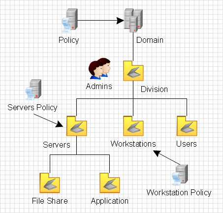
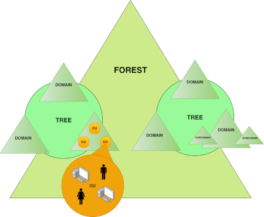
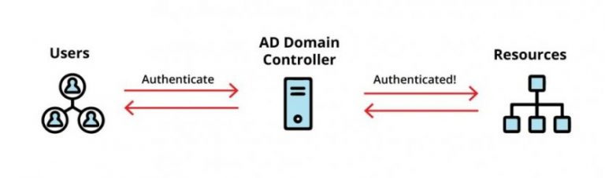
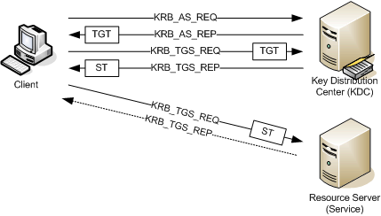

## Table of Contents
- [Preface](#Preface)
- [Acknowledgements](#Acknowledgements)
- [Document Structure and Usage](#Document-Structure-and-Usage)
- [**1-** Introduction](#Introduction)
- [**Chapter-1:** What is Active Directory?](#What-is-Active-Directory?)
- [**Chapter-2:** Active Directory Concepts](#Active-Directory-Concepts)
- [**2-** Samba Active Directory](#Samba-Active-Directory)
- [**Chapter-3:** Samba Active Directory Structure and Comparison with Microsoft AD](#Samba-Active-Directory-Structure-and-Comparison-with-Microsoft-AD)
- [**Chapter-4:** Samba Active Directory Database Structure](#Samba-Active-Directory-Database-Structure)

---

## Preface
SambaAD, which is installed with the Samba software package, is an open-source software developed to provide Microsoft Active Directory services and is distributed under the GPLv3 license.  
SambaAD allows for the setup and management of a Domain and Active Directory environment.  
 
The Samba software project, which began development in 1991 with the aim of enabling Windows and UNIX/Linux environments to work together;  
- First achieved compatibility with LAN Manager and Workgroup environments through Samba 1.  
- With Samba 2, it provided NT4-Style Domain Controller services for Windows clients.  
- Samba 3 introduced file and printer sharing management and FileServer services.  
 
Finally, Samba 4 provided the setup and management services for a Domain and Active Directory environment.  
 
Named after the file and printer sharing protocol SMB, Samba has become a great tool for us thanks to the outstanding work of [Andrew Triggel](https://www.samba.org/~tridge/) and the [Samba Team](https://www.samba.org/samba/team/)

 

And today, we have an excellent option for setting up and managing Domain and Active Directory environments in production environments.  

#### On Paradigm Shift
I'm not sure the paradigm example is the best fit for this work.  
 
If we define paradigm as the accepted way of doing things in a particular field, then Samba software is a great example of a paradigm shifter because it offers an alternative solution.  
Historically, paradigm shifts have been a way to bring about positive change. But sometimes, sticking too closely to the current model can get in the way of  new ideas.  
 
Regardless of whether this topic is the perfect example of a paradigm shift or if it's causing what's known as "paradigm paralysis," which makes it harder to learn and grow, we can still evaluate this work by focusing on the potential of open-source alternatives in the IT world today.  
 
Then, we can get started.

#### Acknowledgements
It's impossible not to acknowledge the efforts behind this work.  
Special thanks to the Samba project team and Andrew Triggel for their incredible contributions.  
Samba4 is a remarkable achievement.  
 
My goal with this work is to offer guidance and consistent study notes to Samba users and to those who are interested in learning and using Samba.  

#### Document Structure and Usage
This work will be kept electronically in this repository.  
It is available in Turkish, English and PDF format.  
 

The study will be updated here.  

**Update:** September 28, 2024

---

 

# 1- Introduction
In this section we will basically talk about Active Directory and its concepts.  
With this section we will have detailed information about AD and AD environment.  
 

## Chapter-1:
## What is Active Directory?

Active Directory is a directory service for network users.  
It stores information about the organisation, such as users, computers, printers, etc. Administrative restrictions can be created on all components and rules can be executed as required.  
 

 

When a user logs on to a computer in a domain environment, Active Directory checks the username and password entered.  
If the login is valid, AD policies authorise it and the user can access network resources.  
 
Active Directory was first released with Windows 2000 Server. It was developed with lots of changes in the Windows 2003 version. With the improvements in Windows 2008 and later versions, it took on its current capabilities. As a result, all identity-related work was collected and managed under AD.  

 

[wikipedia.org/Active Directory](https://en.wikipedia.org/wiki/Active_Directory)

## Chapter-2:
## Active Directory Concepts

If you want to get to grips with the overall structure of an Active Directory (AD) or Samba AD environment, it's really important to understand the basic concepts.  
 

 

- ### Forest
In Active Directory, a forest is the top-level logical structure.  
A forest can have more than one domain, and they're all connected to each other with a trust relationship. All the domain environments in the forest use the same Global Catalog and Schema.

- ### Schema
This defines the object types and their properties that are shared at the forest level and used in all domain environments.

- ### Global Catalog
This contains a copy of all domain environment objects in the forest and provides quick access when searched.

- ### Site
In an Active Directory environment, a site is basically a physical network structure.  
Usually, you'll find that networks in different geographical locations are defined as a site.  
**Site Link:** It's the tool you use to set up connections for replication traffic between each site.

- ### Domain
Before we get into the domain environment, it's important to understand the workgroup environment, which is made up of smaller computer groups.  
A workgroup is a network of computers that are all connected to the same network. They can share files and printers and use each other's resources.  
 
However, there is no central policy for workgroup computers, so each computer decides for itself which resources it can access.  
 
A domain environment is a way of central controlling who can connect to what and similar policies in computer environments that are bigger than just a workgroup.  
 
[wikipedia.org/Workgroup](https://en.wikipedia.org/wiki/Workgroup_(computer_networking))  
[wikipedia.org/WindowsDomain](https://en.wikipedia.org/wiki/Windows_domain)  

- ### Domain Controller
The Domain Controller is the computer where the domain environment is installed.  
It also hosts the Active Directory database, which is used to manage users, computers, groups and other resources in the domain environment.  
 
The Domain Controller basically performs the following tasks;  
    • Authentication  
    • Authorization  
    • Replication  
    • FSMO Roles  
    • Group Policy Management  
  
- ### Domain Join
Domain Join is the process of adding a computer or device to the Active Directory (AD) domain environment.  
The idea of joining is usually used to express membership. Put simply, it's a concept used in the process of making a new component a member of the domain environment.  
 
In order to talk about a domain environment in an organisation, there must be at least one Domain Controller computer in the environment.  
Computers other than the Domain Controller in the organisation join the domain environment run by the Domain Controller.  
Thus, they are subject to the security rules and policies operated by the Domain Controller.  
 
For example, let there be a file server and shares in the domain environment.  
The access request of a domain member computer that wants to access these shares is asked to the Domain Controller computer by the file server and the request is answered according to the response of the Domain Controller computer.  

The Domain Controller computer manages the join process and the policies of the joined computer to access resources and work in the domain environment.  

- ### Domain Member
It refers to a machine that has joined (joined) a domain environment.  

- ### Domain Users Account
The account defined in AD for a user that provides access to network resources.  
Each user account contains specific permissions and authentication information.  
 
User accounts authenticate and log in from member devices according to domain policies and receive access authorisations to resources.  

- ### Domain Groups and Organisation OU (OU)
In a domain environment, these objects are used to organise resources.  
It pertains to the areas where user accounts and computers are members and can be relocated.  
OU objects are utilised for administrative purposes, with the ability to assign different policies and permissions to each OU.  

- ### Group Policy Object (GPO)
It is a tool used to implement policies on computers and users within the domain.  
GPO enables the central application of user settings, security policies and similar administrative tasks to the domain environment.  

- ### FSMO roles (Flexible Single Master Operations roles)
These are the roles that have been assigned the task of managing specific processes at a central level within Active Directory.  
There are five basic FSMO roles; Schema Master, Domain Naming Master, RID Master, PDC Emulator and Infrastructure Master.  
 
These roles are run by Domain Controllers at the Forest and Domain levels.  

- ### Trust
It means that one Domain environment trusts another Domain environment. Through trust relationships, the resources of one Domain environment can be accessed by users in the other Domain environment.  
These trust relationships can be unidirectional or bidirectional and are usually established between Domain environments within the Forest.  

- ### Login
Login is the authentication process of a user account.  
The user allows the system to recognise him/her by entering UserName and Password credentials. The process of checking and recognising the information entered by the system is done from Domain Controller computers.  
    • The user provides credentials.  
    • The information entered is checked by the Domain Controller.  
    • If the credentials provided are correct, authentication is performed and the logon process starts.  

- ### Logon
It is the login process of a user account after the authentication process.  
In this process, an Access Token consisting of information such as the identity and group of the user account is created while opening a session of the user.  
The user session is opened and authorisation and access from policies such as profile settings, network connections are completed.  
 
**Login** determines who the user account is, it does not start a session.  
**Logon** starts a session for the user account after login.  

 

 

◦ **Security ID (SID)**  
An information (username, computer) created in the domain environment SID is a unique identifier created for each user, group and computer object in the domain environment to be used in security and access controls.  
◦ **Access Token**  
A list of credentials and permissions assigned to a user account or a login process. This determines how and which resources a user can access the environment.  
◦ **Kerberos Ticket**  
◦ **Access Control List (ACL)**  
Access Control List is a list that holds who can access a resource such as a file, directory, network share and at what level. 
 
Logon process;  
    • Authentication is successfully completed (login)  
    • Kerberos Ticket and Access Token are created  
    • Access Control List is created  

- ### Kerberos Protocol and Kerberos Tickets
The Kerberos protocol is the predefined protocol for authentication in the Active Directory environment.  
It provides secure authentication of users and services as a centralised component.  
 
The Kerberos protocol provides the following functions;  
    • Authentication  
    •  Single Sign-On  
    •  Authorization  

- ### Kerberos Tickets
Once the user has authenticated, the user is issued a Ticket Granting Ticket (TGT).  
With this TGT, Service Ticket is provided for access to different services.  
 
Thus, there is no need to authenticate repeatedly while accessing different services and applications in the same session. Kerberos Tickets are used for this.  
Kerberos Tickets contain encrypted keys that prove the user's identity and session.  
 
Kerberos Tickets are time limited in validity.  
 
**TGT Duration:** The default validity period of the TGT ticket issued to the user upon logon is 10 hours.  
**Ticket Renewal:** Kerberos Tickets can be renewed. The renewal period is 7 days by default.  
The renewal validity period is used to renew the TGT when it expires without re-authentication.  
 

 
[from markwilson.co.uk](https://www.markwilson.co.uk/blog/2005/06/kerberos-authentication-explained.htm)
 
 
The default duration of a Kerberos ticket is 10 hours, and the maximum time the ticket is renewable is 7 days.  
If the ticket expires during the session, the Kerberos client automatically requests the KDC to renew the ticket and the session continues with a renewed ticket without interruption.  
If the maximum renewable period also expires, the user is asked to re-authenticate.  

- ### DNS
Active Directory includes its own DNS server, which manages the SRV records and other DNS entries required for AD to function.  
Typically, the DNS role is added to the Domain Controller (DC) when the domain is being set up.  
Active Directory uses dynamic DNS updates to automatically update the IP addresses of Domain Controllers and other services.  
 
Additionally, it manages DNS Zone records, which contain domain names and IP addresses.  

- ### Functional Level
A Functional Level refers to a specific version and set of features within an Active Directory environment.  
It determines the features available across the domain and which version supports them.  

- ### Domain Functional Level (DFL)
This refers to the specific functional level for each domain. It defines what features are supported by the Domain Controllers and other services within that domain.  

- ### Forest Functional Level (FFL)
This refers to the functional level across the entire forest. It sets the common features and functions shared by all domains within the forest.  

---

# 2- Samba Active Directory
Samba Active Directory (SambaAD) is an environment for setting up and managing Active Directory and domains that was added and developed with the Samba 4 version.  
 
The Samba software was a highly successful and widely used project that provided file and printer sharing services in its first three versions.  
The work on Samba 4 began in 2005, incorporating the following Active Directory component features:  

• The Active Directory component  
• The file sharing smbd component  
• The user mapping winbindd component  
 
In December 2012, the stable release of Samba 4.0.0 was published by adding Active Directory functionality to the maintained Samba 3 code.

Thanks.. https://www.samba.org/samba/history/samba-4.0.0.html  
At the beginning of this work, Triggel's presentation for this project can be found here: https://www.samba.org/ftp/samba/slides/samba4_auug.pdf  

**A Note from History:**  
In 2004, the European Commission, characterizing Active Directory as a network software, subjected Microsoft to a requirement to disclose and publish its specifications due to the abuse of market dominance according to competition law.  
This ruling and the support of Commissioner Neelie Kroes for it represent a milestone step for the awareness and support of open-source projects.  
https://en.wikipedia.org/wiki/Microsoft_Corp._v._Commission  
https://en.wikipedia.org/wiki/Neelie_Kroes  
 
Although Microsoft officially documented and published the specifications for Active Directory as required by the ruling, these documents could not be utilized during the development process of the Samba 4 version.  

## Chapter-3:
## Samba Active Directory Structure and Comparison with Microsoft AD

In this section, we will discuss the basic structure of the Samba Active Directory (SambaAD) environment and the differences between it and Microsoft Active Directory (AD).  
By doing so, you will gain a clear understanding of SambaAD.  
 
Both Samba Active Directory and Microsoft Active Directory are systems built on database and directory structures, using various database files to manage users, groups, computers, and other directory objects.   
While both systems share similar core principles, there are some important differences in how they manage data and structure their files.  
 
**In Microsoft Active Directory**, all directory service information (users, groups, computer accounts, security policies, etc.) is stored in a single file called NTDS.dit (New Technology Directory Services). This file contains the entire AD database in one location.  
**In Samba Active Directory**, there is no direct equivalent to the NTDS.dit file. Instead, SambaAD uses an LDAP (Lightweight Directory Access Protocol) based system, where information is stored in various LDB files, such as sam.ldb. LDAP is a protocol used for configuring directory services and querying data, and Samba’s database system is built around this protocol.  
 
The SambaAD environment consists of several .ldb database files, each designed to store and manage specific types of data.  
For example, users, groups, permissions, and other administrative settings are stored in these specialized database files.  
While these files perform a similar function to the NTDS.dit file in Windows Active Directory, they use a different format and structure.  
 
SambaAD stores data in the LDB format, and the data is managed through an LDAP-like structure.  
This means that while Samba offers an open-source alternative to Microsoft Active Directory, it also provides flexibility in how its database structure is managed.  

---

### Samba Active Directory and Functional Levels
Functional Levels determine whether certain features of an AD domain are enabled and what minimum operating systems can be used.  
Samba AD uses the Domain Functional Level (DFL) and Forest Functional Level (FFL) concepts, similar to Microsoft AD.  
 
Samba AD generally supports functionality up to Windows Server 2008 R2.  
Some features may be missing at higher levels today. (See Samba Releases)  
 
Functional levels determine the features and functions that Samba AD supports.  
In Samba AD, domain and forest levels are also configured in accordance with specific versions and features.  

• **Domain Functional Level:** Determines the domain functional level that Samba supports.  
• **Forest Functional Level:** Determines the features and levels of all domain environments at the forest level.  

## Chapter-4:
## Samba Active Directory Database Structure

- ### sam.ldb
In Samba AD, this is the main database where users, groups, computers, and other directory objects are stored. It serves as the core file where AD objects and directory information are maintained.  
It corresponds to the NTDS.dit file in Microsoft Active Directory  
It is typically located in the directory /var/lib/samba/private/sam.ldb  

- ### secrets.ldb
This database stores the passwords used by Samba, particularly Kerberos keys and sensitive data related to other security information.  
It also holds machine account passwords and the security relationships of Active Directory Domain Controller servers. This file is crucial for ensuring secure communication between DCs.  

- ### dns.ldb
It is used to manage DNS records in AD environment. If Samba AD uses the internal DNS server (dns-backend=SAMBA_INTERNAL), DNS records are stored in the dns.ldb file. If DNS is used with BIND9_DLZ mode, it pulls dynamic DNS records for BIND from here.

- ### privilege.ldb
Determines the administrative rights and privileges that users and groups have.
For example, this file determines which users are in the Domain Admins group or which users are authorised to perform certain administrative tasks. Tasks such as managing privileged accounts in Windows are tracked here.

- ### group_mapping.ldb
Manages the relationship between Unix systems and Windows groups. That is, it determines which group an AD group corresponds to in Unix, how group IDs are mapped, and how these groups are represented on POSIX (Unix/Linux) systems.
It ensures compatibility between Windows groups and Unix groups, especially in Samba file sharing.

- ### idmap.ldb
Used for identity mapping between Unix and Windows users/groups.  
When users and groups in Active Directory connect to Unix systems, each must have a corresponding UID and GID.  
idmap.ldb organises how these identities are managed, what ranges are used, and the UID/GID mappings.

---

- ### Data Storage Format
    • Microsoft AD: Uses a database based on ESE (Extensible Storage Engine).  
    • Samba AD: Stores data in LDB (LDAP Database) format. LDB is based on LDAP and is optimized for Samba's directory services.  

- ### Replication
    • Microsoft AD replicates data between Domain Controller servers using the NTDS.dit database. SYSVOL share replication is provided using FRS or DFS-R.  
    • Samba AD manages replication using KCC and ensures data consistency over LDB files.  

- ### KCC (Knowledge Consistency Checker)
KCC is a mechanism that dynamically creates and manages the replication topology in Active Directory.  
It allows each DC to synchronize data with others. The main function of KCC is to establish replication connections between DCs to ensure that all data in AD remains consistent.  
The proper functioning of replication is critical for the reliability and consistency of Active Directory.  
 
▪ Dynamically creates a replication topology  
▪ Checks the created topology (default every 15 minutes)  
▪ Updates the topology if a DC is added or removed from the environment  
▪ Creates Connection Objects. This connection object keeps track of which directories, partitions, etc. the DC servers will copy to each other  
