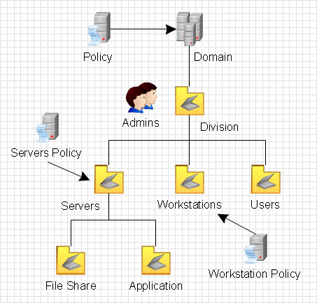
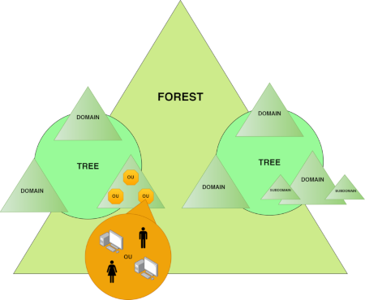
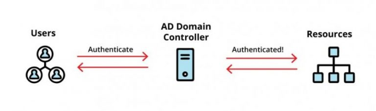
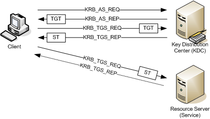

## İçindekiler

- [Önsöz](#%C3%B6nsöz)
- [Teşekkür](#te%C5%9Fekkür)
- [Belgenin Yapısı ve Kullanımı](#Belgenin-Yapısı-ve-Kullanımı)
- [**1-** Giriş](#Giri%C5%9F)
- [**Bölüm-1:** Active Directory Nedir?](#Active-Directory-Nedir)
- [**Bölüm-2:** Active Directory Kavramları](#Active-Directory-Kavramları)
- [**2-** Samba Active Directory](#Samba-Active-Directory)
- [**Bölüm-3:** Samba Active Directory Yapısı ve Microsoft AD ile Karşılaştırılması ](#Samba-Active-Directory-Yapısı-ve-Microsoft-AD-ile-Karşılaştırılması)
- [**Bölüm-4:** Samba Active Directory Veritabanı Yapısı](#Samba-Active-Directory-Veritabani-Yapisi)

## Önsöz
Samba yazılım paketi ile kurulan SambaAD, Microsoft Active Directory hizmetlerini sunmak üzere geliştirilen ve  GPLv3 lisansı ile dağıtılan bir açık kaynak yazılımdır.  
SambaAD, bir Etki Alanı ve Active Directory ortamının kurulması ve yönetilmesini sağlar.  
 
1991 yılında Windows ve UNIX/Linux ortamlarının birlikte çalışmaya olanak sağlaması hedefiyle geliştirilmeye başlanan Samba yazılımı projesi;  
Samba1 ile LANManager ve Workgroup ortamlarına uyum sağladı.  
Samba2 ile Windows istemciler için NT4-Style Domain Controller hizmetlerini sağladı.  
Samba3 ile dosya ve yazıcı paylaşımlarının yönetimi ve FileServer hizmetini sağladı.  
Ve Samba4 ile bir Domain ve Active Directory ortamı kurulum ve yönetim hizmeti sağladı.  
Adını dosya ve yazıcı paylaşım protokolü SMB’den alan Samba, Andrew Triggel ve Samba Team ekibinin eşsiz çalışmalarıyla bizim için harika bir araç olmuştur.  
 
Ve bugün büyük üretim ortamlarında Domain ve Active Directory ortamının kurulumu ve yönetimi için kullanabileceğimiz mükemmel bir seçeneğimiz var.  
 
**Paradigma Değişikliğine Dair**  
Bu çalışma konusunda paradigma örneği ne kadar uygun olur, bilmiyorum.  
Paradigma, bir alandaki geçerli modeli ifade ediyorsa eğer Samba yazılımı, alternatif sunduğu çözüm için tipik bir paradigma değiştiricisidir.  
Paradigma değişimi, tarihte ve bilimde her zaman olumlu değişimleri örneklemiştir.  
Geçerli modele fazlasıyla bağlılık, yeni modeli kabul edip geçmeye engel oluşturabilir.   
Ne öğrenmeye ve gelişime engel olan paradigma felcine ne de bu konu için paradigma değişimi örneğinin uygun olup olmadığına bakmaksızın günümüzde IT dünyasındaki açık kaynak alternatiflerin gücüne ve bize kattıklarına odaklanarak;  
bunları anlama eğilimi ile bu çalışmayı değerlendirebilirsiniz..  
O zaman başlayabiliriz..  
 
Bu çalışma;  
Active Directory kavramlarına temel olarak değinecek olsa da asıl amaç;  
Üretim ortamı senaryoları ile kurulum, yapılandırma, bakım ve problem giderme gereksinimleri için SambaAD incelemesi ve pratik çalışmalarını yapmaktır.  
Bu çalışma ile baştan Active Directory öğrenme ve Samba ile Active Directory ortamını kullanmayı tüm yönleriyle elde edeceksiniz.  
 
#### Teşekkür
Bu çalışmada bu satırları yazmazsak olmaz.  
Özellikle Samba proje ekibi ve Andrew Triggel’e böylesine harika bir çalışma için çok teşekkürler..  
Samba4 çok büyük bir iş ve büyük bir başarıdır.  
Bu çalışmadaki amaç; Samba kullanıcılarına ve tanıyıp kullanmak isteyenlere doküman ve düzenli çalışma notları verebilmektir.  

#### Belgenin Yapısı ve Kullanımı
Bu çalışma, bu repoda elektronik olarak tutulacaktır.  
Türkçe, İngilizce ve indirilebilir PDF dosyası formatları da buradan erişilebilir olacaktır.  
 
Yapılan çalışmalar buradan güncellenecektir.  
 
**Güncelleme:** 28 Eylül 2024

---

 

# 1- Giriş
Bu bölümde temel olarak Active Directory ve kavramlarından bahsedeceğiz.  
Bu bölüm ile AD ve AD ortamı hakkında detaylı bilgi sahibi olacağız.

 

## Bölüm-1: Active Directory Nedir?
Active Directory, ağ kullanıcıları için kaynak dizini görevi gören bir dizin hizmetidir.  
Bu dizin hizmeti ile bir veritabanında kullanıcılar, bilgisayarlar, yazıcılar gibi organizasyonun tüm bilgileri saklanır.  
Organizasyondaki tüm bileşenlere (bu esasında bir kimliktir) yönetimsel kısıtlamalar oluşturulabilir ve ihtiyaçlar doğrultusunda kurallar işletilebilir.
Active Directory, bir DC makinesi kurularak çalıştırılır.  
 
Bir kullanıcı hesabı, domain ortamındaki bir bilgisayarda oturum açtığında;  
Active Directory, girilen kullanıcı adı ve parolayı kontrol eder.  
Oturum açabilen bir giriş bilgisi sağlandıysa AD politikaları ile yetkilendirilir ve aldığı yetkiye göre ağ kaynaklarına erişim sağlar.  
 
Active Directory ilk olarak Windows 2000 Server ile yayınladı.  
Windows 2003 sürümünde önemli revizeler ile geliştirildi.  
Windows 2008 ve sonraki sürümlerdeki geliştirmelerle bugünkü yeteneklerini aldı.  
Sonuç olarak; kimlikle ilgili her iş, AD altında toplandı ve yönetildi.  

 
 

 
 
[wikipedia.org/Active Directory](https://en.wikipedia.org/wiki/Active_Directory)

## Bölüm-2: Active Directory Kavramları
Active Directory (AD) veya Samba Active Directory ortamlarında, temel kavramların anlaşılması ortamın genel yapısının kavranması için oldukça önemlidir.  
 

 

- ### Forest
Forest, Active Directory ortamının en üst düzeydeki mantıksal yapısıdır.  
Bir forest, birden fazla Domain içerebilir ve bunlar birbirine güven ilişkisi (trust) ile bağlıdır.  
Forest içindeki tüm domain ortamları, ortak bir Global Catalog ve Schema paylaşır.  

- ### Schema
Schema, Forset düzeyinde paylaşılan ve tüm Domain ortamlarında kullanılan nesne türlerini ve bunların özelliklerini tanımlar.  

- ### Global Catalog
Forest içindeki tüm Domain ortamı nesnelerin bir kopyasını içerir ve arama yapıldığında hızlı erişim sağlar.  

- ### Site
Site, bir Active Directory ortamındaki fiziksel ağ yapısını ifade eden bir kavramdır.  
Genellikle, farklı coğrafi konumlara sahip olan ağlar, birer Site olarak tanımlanır.  
**Site Link:** Her bir Site arasındaki replikasyon trafiği için bağlantı kurma aracıdır.  

- ### Domain
Domain ortamından önce küçük bilgisayar gruplarından oluşan Workgroup ortamından bahsetmek gerekir.  
Workgroup ortamları aynı ağda bulunan birkaç bilgisayar gruplarından oluşan bir çalışma ağıdır.  
Workgroup içindeki bilgisayarlar arasında dosya ve yazıcı paylaşımları yapılır ve kaynakları ortak kullanabilirler. Fakat Workgroup ortamındaki bilgisayarlara merkezi bir politika uygulanmaz ve her kaynağın erişimi o kaynağı sunan workgroup üyesi bilgisayar tarafından yapılan ayarla bilgisayar üzerinde tutulur.  
 
Domain ortamı ise workgroup kavramından daha büyük bilgisayar ortamlarında kimin nereye bağlanacağı ve buna benzer politikaların merkezi olarak kontrol edilebildiği bir ortamdır.  

[wikipedia.org/Workgroup](https://en.wikipedia.org/wiki/Workgroup_(computer_networking))  
[wikipedia.org/WindowsDomain](https://en.wikipedia.org/wiki/Windows_domain)  

- ### Domain Controller
Domain Controller, domain ortamının kurulduğu bilgisayardır.  
Domain Controller, Active Directory veritabanını barındırır ve bu veritabanı ile domain ortamını
kullanıcı, bilgisayar, grup ve diğer kaynakları yönetir.  
 
Domain Controller temel olarak aşağıdaki işleri yapar;  
            ▪ Kimlik Doğrulama  
            ▪ Yetkilendirme  
            ▪ Replikasyon  
            ▪ FSMO Rolleri  
            ▪ Grup Politika Yönetimi  

- ### Domain Join
Domain Join, bir bilgisayarın veya cihazın, Active Directory (AD) domain ortamına dahil edilmesi sürecidir.  
Join kavramı genel olarak üye olmayı ifade etmekte kullanılır.  
Yani domain ortamına yeni bir bileşeni üye yapma işleminde kulanılan bir kavramdır.  
 
Bir organizasyonda domain ortamından bahsetmemiz için ortamda en az bir tane Domain Controller bilgisayar olması gerekir.  
Organizasyondaki Domain Controller dışındaki bilgisayarlar Domain Controller tarafından çalıştırılan domain ortamına join olurlar.  
Böylece Domain Controller tarafından işletilen güvenlik kurallarına ve politikalara tabi olurlar.  
Domain Controller bilgisayar, join işlemini ve join olmuş bilgisayarın kaynaklara erişim ve domain ortamında çalışma ilkelerini yönetir.  
 
Örneğin domain ortamında bir dosya sunucusu ve paylaşımları olsun.  
Bu paylaşımlara erişmek isteyen bir domain üyesi bilgisayarın erişim talebi, dosya sunucusu tarafından Domain Controller bilgisayara sorulur ve Domain Controller bilgisayarın cevabına göre talep yanıtlanır.

- ### Domain Member
Bir domain ortamına join olmuş (katılmış) bir makineyi ifade eder.  

- ### Domain Users Account
Bir kullanıcı için AD'de tanımlanan ve ağ kaynaklarına erişim sağlayan hesaptır.  
Her kullanıcı hesabı, belirli izinler ve kimlik doğrulama bilgileri içerir.  
 
Kullanıcı hesapları, domain politikalarına göre üye cihazlardan kimlik doğrulama yapıp oturum açar ve kaynaklara erişim yetkileri alır. 

- ### Domain Groups, Organization OU (OU)
Bir domain ortamındaki kaynakları organize etmek için kullanılan objelerdir.  
Kullanıcı hesapları ve bilgisayarların üye oldukları, taşındıkları alanları ifade eder.  
OU nesneleri, yönetimsel amaçlarla kullanılır ve her bir OU’ya farklı politikalar ve izinler atanabilir.  

- ### Group Policy Object (GPO)
Domain içindeki bilgisayarlar ve kullanıcılar üzerinde politika uygulamak için kullanılan bir araçtır.  
GPO ile domain ortamına, kullanıcı ayarları, güvenlik politikaları ve bunun gibi yönetimsel görevler merkezi olarak uygulanır.  

- ### FSMO Roles (Flexible Single Master Operations Roles)
AD içinde bazı belirli görevlerin merkezi olarak yönetilmesi için atanmış olan rollerdir.  
Beş temel FSMO rolü vardır;  
Schema Master, Domain Naming Master, RID Master, PDC Emulator ve Infrastructure Master  
Bu roller, Forest ve Domain düzeyinde Domain Controller sunucular tarafından çalıştırılır. 

- ### Trust
Bir Domain ortamının başka bir Domain ortamına güvenmesi anlamına gelir.  
Güven ilişkileri sayesinde bir Domain ortamının kaynaklarına, diğer Domain ortamındaki kullanıcılar erişebilir.  
Bu güven ilişkileri, tek yönlü ya da çift yönlü olabilir ve genellikle Forest içindeki Domain ortamları arasında kurulur.  

- ### Login
Login bir kullanıcı hesabının kimlik doğrulama sürecidir.  
Kullanıcı, KullanıcıAdı ve Parola kimlik bilgilerini girerek sistemin kendisini tanımasını sağlar. Sistemin girilen bilgileri kontrol ve tanıma süreci Domain Controller bilgisayarlardan yapılır.
            ▪ Kullanıcı, kimlik bilgilerini sağlar.  
            ▪ Girilen bilgiler, Domain Controller tarafından kontrol edilir.  
            ▪ Sağlanan kimlik bilgileri doğruysa kimlik doğrulama yapılır ve logon sürecine geçilir.  

- ### Logon
Bir kullanıcı hesabının, kimlik doğrulama işlemi sonrası oturum açma sürecidir.  
Bu süreçte kullanıcıya ait bir oturum açılırken kullanıcı hesabının kimlik, grup gibi bilgilerden oluşan Access Token oluşturulur.  
Kullanıcı oturumu açılır ve profil ayarları, ağ bağlantıları gibi politikalardan yetkilendirme ve erişim tamamlanmış olur.  
 
**Login,** kullanıcı hesabının kim olduğunu belirler, oturum başlatmaz.  
**Logon,** login sonrası kullanıcı hesabına ait bir oturum başlatır.  

 

 

◦ **Security ID (SID)**  
An information (username, computer) created in the domain environment SID is a unique identifier created for each user, group and computer object in the domain environment to be used in security and access controls.  
◦ **Access Token**  
A list of credentials and permissions assigned to a user account or a login process. This determines how and which resources a user can access the environment.  
◦ **Kerberos Ticket**  
◦ **Access Control List (ACL)**  
Access Control List is a list that holds who can access a resource such as a file, directory, network share and at what level. 
 
      Logon işlemi süreci;  
            ▪ Kimlik doğrulama başarıyla tamamlanır (login)  
            ▪ Kerberos Ticket ve Access Token oluşturulur.  
            ▪ Access Control List oluşturulur.  

- ### Kerberos Protokolü ve Kerberos Tickets
Kerberos protokolü, Active Directory ortamında kimlik doğrulamanın ön tanımlı protokolüdür.  
Kullanıcı ve hizmetlerin kimlik doğrulamasının merkezi bir bileşen olarak güvenli şekilde yapılmasını sağlar.  
 
Kerberos protokolü aşağıdaki işlevleri sağlar;  
• Authentication  
• Single Sign-On  
• Authorization  

- ### Kerberos Tickets
Kullanıcı bir kez kimlik doğrulaması yaptıktan sonra kullanıcıya Ticket Granting Ticket (TGT) verilir.  
Bu TGT ile farklı hizmetlere erişim için Service Ticket sağlanır.  
 
Böylece aynı oturumda farklı hizmet ve uygulamalara erişim sağlanırken tekrar tekrar kimlik doğrulaması yapılmasına gerek kalmaz. Bunun için Kerberos Tickets kullanılır.  
Kerberos Tickets, kullanıcının kimliğini ve oturumunu kanıtlayan şifreli anahtarlar içerir.  
 
Kerberos Tickets, geçerlilikleri süreyle sınırlıdır.  
 
**TGT Süresi:** Kullanıcıya logon ile verilen TGT biletinin varsayılan geçerlilik süresi 10 saatir.  
**Ticket Renewal:** Kerberos Tickets yenilenebilir. Yenilenebilme süresi varsayılan olarak 7 gündür.  
Yenileme geçerlilik süresi, TGT’nin geçerlilik süresi dolduğunda tekrar kimlik doğrulaması yapılmadan yenilenmesi için kullanılır.  
 

 
[markwilson.co.uk adresinden alınmıştır.](https://www.markwilson.co.uk/blog/2005/06/kerberos-authentication-explained.htm)
 
 
Bir Kerberos biletinin varsayılan ömrü 10 saattir ve yenilenebileceği maksimum süre 7 gündür.  
Bir oturum sırasında biletin süresi dolarsa, Kerberos istemcisi otomatik olarak KDC'den bir yenileme talep eder ve oturumun yeni bir biletle sorunsuz bir şekilde (kesintiye uğramadan) devam etmesine izin verir.  
Ancak, maksimum yenileme süresi de geçtiyse, kullanıcıdan yeniden kimlik doğrulaması yapması istenecektir.  

- ### DNS
Active Directory, AD'nin çalışması için gereken SRV kayıtlarını ve diğer DNS girişlerini yöneten kendi DNS sunucusunu içerir. Genellikle, etki alanı kurulurken Etki Alanı Denetleyicisine (DC) DNS rolü eklenir.  
Active Directory, Etki Alanı Denetleyicilerinin ve diğer hizmetlerin IP adreslerini otomatik olarak güncellemek için dinamik DNS güncellemelerini kullanır.  
 
Ayrıca, etki alanı adlarını ve IP adreslerini içeren DNS Bölge kayıtlarını yönetir.

- ### Functional Level
Active Directory ortamındaki belirli bir sürümü ve özellikler kümesini ifade eder. Etki alanı genelinde kullanılabilen özellikleri ve hangi sürümün bunları desteklediğini belirler.

- ### Domain Functional Level (DFL)
Her domain için belirli işlevsel düzeyi ifade eder. Domain içindeki Domain Controller ve diğer hizmetler tarafından hangi özelliklerin desteklendiğini tanımlar.

- ### Forest Functional Level (FFL)
Tüm orman genelindeki işlevsel düzeyi ifade eder. Orman içindeki tüm etki alanları tarafından paylaşılan ortak özellikleri ve işlevleri belirler.

---

# 2- Samba Active Directory
Samba Active Directory (SambaAD), Samba4 sürümüyle birlikte yazılıma eklenen ve geliştirilen bir Active Directory ve Domain kurma ve yönetme ortamıdır.  
 
Samba yazılımı ilk 3 sürümünde dosya ve yazıcı paylaşım hizmetleri işlerini yapmış oldukça başarılı ve yaygın bir projedir. Samba4 sürümü çalışmaları 2005 yılında aşağıdaki Active Directory bileşeni özellikleri eklenerek yeniden yazılmaz için başlamıştır.  

• The Active Directory component – Active Directory bileşeni  
• The file sharing smbd component – smbd ve File Sharing  
• The user mapping winbindd component - winbindd bileşeni ile User Mapping  
 
2012 Aralık ayında bakımı yapılmış Samba3 kodu üzerine Active Directory işlevi eklenerek Samba 4.0.0 kararlı sürümü yayınlandı.  
 
https://www.samba.org/samba/history/samba-4.0.0.html
 

Teşekkürler.. https://www.samba.org/samba/team/  
Bu çalışmanın başlangıcında Triggel’in söz konusu çalışma için yaptığı sunum; https://www.samba.org/ftp/samba/slides/samba4_auug.pdf
 

**Tarihten bir not:**  
Avrupa Birliği komisyonu 2004 yılında bir ağ yazılımı olarak nitelendirdiği Active Directory için rekabet kanuna göre pazar hakimiyetinin kötüye kullanılması nedeniyle Microsoft’u açık etme ve spesifikasyonlarını yayınlama mecburiyetine tabi tutmuştur.  
Bu yargı kararı ve bunu savunan komisyon üyesi Neelie Kroes’un desteği, açık kaynak bilinci ve projelerinin desteklenmesi için kilometre taşı niteliğinde bir adımdır.  
https://en.wikipedia.org/wiki/Microsoft_Corp._v._Commission  
https://en.wikipedia.org/wiki/Neelie_Kroes  
 
Microsoft, karar gereği resmi olarak Active Directory spesifikasyonlarının belgelendirme ve yayınını yapsa da söz konusu belgelerden Samba4 sürümü geliştirme sürecinde yararlanılamamıştır.  
 
## Bölüm-3: Samba Active Directory Yapısı ve Microsoft AD ile Karşılaştırılması
Bu bölümde, Samba Active Directory (SambaAD) ortamının temel yapısından ve Microsoft Active Directory (AD) ile arasındaki farklardan bahsedeceğiz.  
Böylece SambaAD hakkında yeterli bir fikir sahibi olacaksınız.  
 
Hem Samba Active Directory hem de Microsoft Active Directory, kullanıcı, grup, bilgisayar ve diğer dizin objelerini yönetmek için çeşitli veritabanı dosyalarını kullanan sistemlerdir.  
Temel olarak her ikisi de veritabanı ve dizin yapıları üzerine inşa edilmiştir. Ancak, bu iki sistemin veri yönetimi ve dosya yapısı açısından bazı önemli farklılıkları vardır.  
 
**Microsoft Active Directory**'de, tüm dizin hizmeti bilgileri (kullanıcılar, gruplar, bilgisayar hesapları, güvenlik politikaları vb.) **NTDS.dit** (New Technology Directory Services) dosyasında tutulur.  
**Samba Active Directory**'de, NTDS.dit dosyasına doğrudan bir karşılık yoktur. Bunun yerine Samba AD, LDAP (Lightweight Directory Access Protocol) tabanlı bir sistem kullanır ve bilgiler **sam.ldb** gibi çeşitli LDB dosyalarında tutulur.  
LDAP, dizin hizmetlerinin yapılandırılması ve verilerin sorgulanması için kullanılan bir protokoldür ve Samba'nın veritabanı sistemi bu protokolü temel alır.  
 
SambaAD ortamında her biri belirli türdeki verileri saklamak ve yönetmek amacıyla tasarlanmış olan **.ldb** veritabanı dosyaları vardır.  
SambaAD ortamındaki, örneğin; kullanıcılar, gruplar, yetkiler ve buna benzer yönetimsel ayarlar bu özel veritabanı dosyalarında tutulur.  
Bu veritabanı dosyaları tümüyle Windows Active Directory ortamındaki **NTDS.dit** dosyasına karşılık gelir.  

Samba, LDB formatını kullanır ve veriler genellikle LDAP benzeri bir yapı ile yönetilir.  
 
SambaAD verileri LDB formatında saklar ve veriler LDAP benzeri bir yapıyla yönetilir. Bu, Samba'nın Microsoft Active Directory'ye açık kaynaklı bir alternatif sunarken, kendi veritabanı yapısıyla yönetim esnekliği sağladığı anlamına gelir.  

## Bölüm-4: Samba Active Directory Veritabanı Yapısı
- ### sam.ldb
Samba AD'de kullanıcılar, gruplar, bilgisayarlar ve diğer dizin objelerinin saklandığı ana veritabanıdır.  
Bu veritabanı, AD objelerinin ve dizin bilgilerinin saklandığı temel dosyadır.  
Microsoft Active Directory NTDS.dit dosyasına karşılık gelir. Genellikle /var/lib/samba/private/sam.ldb dizininde bulunur.

- ### secrets.ldb
Samba tarafından kullanılan şifrelerin, özellikle Kerberos anahtarlarının ve diğer güvenlik bilgileriyle ilgili hassas verilerin saklandığı veritabanıdır.  
Ayrıca makine hesap şifrelerini ve Active Directory Domain Controller sunucularının güvenlik ilişkilerini saklar.  
Bu dosya, özellikle DC'ler arasında güvenli iletişimi sağlamak için önemlidir.

- ### dns.ldb
AD ortamında DNS kayıtlarını yönetmek için kullanılır.
Samba AD dahili DNS sunucusunu kullanıyorsa, (dns-backend=SAMBA_INTERNAL) DNS kayıtları dns.ldb dosyasında saklanır.
Eğer DNS, BIND9_DLZ moduyla kullanılıyorsa, BIND için dinamik DNS kayıtlarını buradan çeker.

- ### privilege.ldb
Kullanıcıların ve grupların sahip olduğu yönetici haklarını ve ayrıcalıklarını belirler.  
Örneğin, hangi kullanıcıların Domain Admins grubunda olduğunu veya hangi kullanıcıların belirli yönetimsel görevleri yerine getirme yetkisine sahip olduğunu bu dosya belirler.

- ### group_mapping.ldb
Unix sistemleri ile Windows grupları arasındaki ilişkiyi yönetir.  
Bir AD grubunun Unix'te hangi gruba denk geldiğini, grup kimliklerinin nasıl eşleştirildiğini ve bu grupların POSIX (Unix/Linux) sistemlerinde nasıl temsil edildiğini belirler.  
Özellikle Samba'nın dosya paylaşımlarında, Windows grupları ile Unix grupları arasındaki uyumu sağlar.

- ### idmap.ldb
Unix ve Windows kullanıcıları/grupları arasında kimlik eşlemesi için kullanılır.  
Active Directory'deki kullanıcılar ve gruplar Unix sistemlerine bağlandığında, her birinin karşılık gelen bir UID ve GID'si olmalıdır.  
idmap.ldb, bu kimliklerin nasıl yönetildiğini, hangi aralıkların kullanıldığını ve UID/GID eşlemelerini düzenler.

---

- ### Veri Depolama Formatı
    • Microsoft AD: ESE (Extensible Storage Engine) tabanlı bir veritabanı kullanır.  
    • Samba AD: LDB (LDAP Database) formatında verileri depolar. LDB, LDAP'ı temel alır ve Samba'nın dizin hizmetleri için optimize edilmiştir.  
    
- ### Replikasyon
    • Microsoft AD, NTDS.dit veritabanını kullanarak domain controller'lar arasında verilerin replikasyonu yapılır. FRS veya DFS-R kullanılarak SYSVOL paylaşımı replikasyonu sağlanır.  
    • Samba AD, KCC'yi kullanarak replikasyonu yönetir ve LDB dosyaları üzerinden veri tutarlılığını sağlar.  
     

- ### KCC (Knowledge Consistency Checker)
KCC, Active Directory'de replikasyon topolojisini dinamik olarak oluşturan ve yöneten bir mekanizmadır.  
 
Her bir DC'nin diğerleriyle veri senkronizasyonu yapmasını sağlar.  
KCC'nin temel işlevi, AD'deki tüm verilerin tutarlı kalmasını sağlamak için DC'ler arasında replikasyon bağlantıları kurmaktır.  
Replikasyonun düzgün çalışması, Active Directory'nin güvenilirliği ve tutarlılığı açısından kritik öneme sahiptir.  
 
            ▪ Dinamik olarak replikasyon topolojisi oluşturur.  
            ▪ Oluşturulan topolojiyi (öntanımlı 15 dakikada bir) kontrol eder.  
            ▪ Ortama DC eklenmiş veya çıkarılmışsa topolojiyi günceller.  
            ▪ Connection Objects oluşturur. Bu bağlantı objesi ile DC sunucular birbirine kopyalayacağı dizin, bölüm vb alanları tutar.  
 
